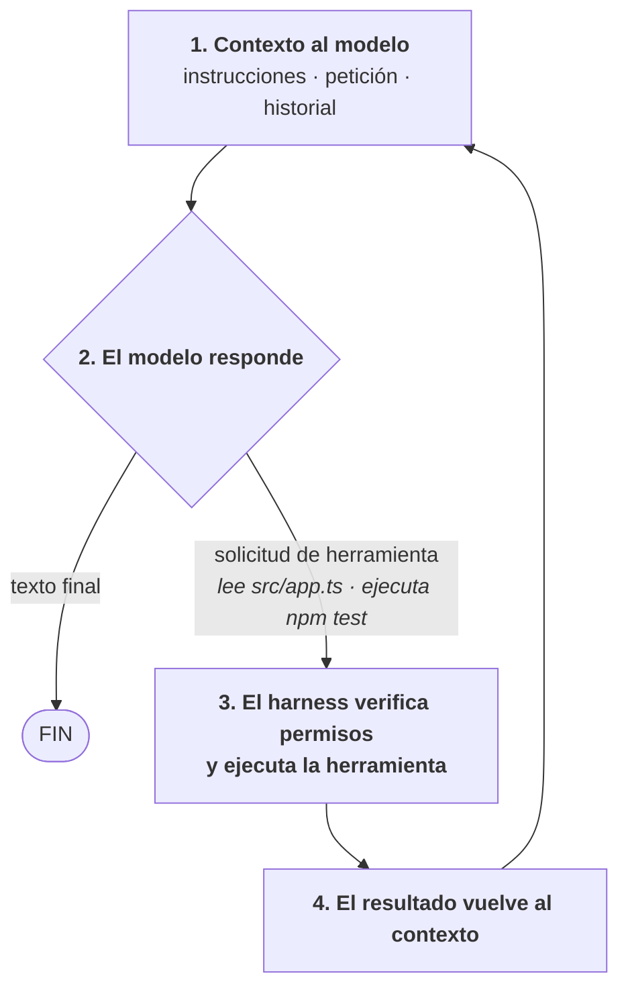

<div class="grid cards" markdown>

-   :material-information-outline: &nbsp; **Article Info**

    ---

    - :fontawesome-solid-globe: **Topic:** AI Coding Agents / Harness
    - :fontawesome-solid-laptop-code: **OS:** macOS / Linux / WSL / Windows
    - :fontawesome-solid-bolt: **Level:** :fontawesome-solid-circle:{ .diff-easy } Beginner

-   :material-tools: &nbsp; **Tools & Technologies**

    ---

    - `claude` — Claude Code (Anthropic)
    - `codex` — Codex CLI (OpenAI)
    - `agy` — Antigravity CLI (Google)
    - `opencode` — OpenCode (open source)

</div>

---

# Harness de agentes de código: qué son y cómo instalarlos

Los asistentes de programación en terminal como **Claude Code**, **Codex CLI**, **Antigravity CLI** y **OpenCode** suelen compararse por el modelo que usan. Pero buena parte de lo que los hace útiles (o peligrosos) no está en el modelo, sino en el software que lo envuelve: el **harness**.

Este documento explica el concepto, compara las cuatro herramientas y reúne los métodos de instalación oficiales para cada una.

!!! note
    Los comandos de instalación fueron verificados en septiembre de 2026. Estas herramientas cambian rápido; ante cualquier duda, consulta la documentación oficial enlazada en cada sección.

---

## 1. ¿Qué es un harness?

La fórmula más simple es:

```text
Agente = Modelo + Harness
```

- El **modelo** (Claude, GPT, Gemini, un modelo local) es el que razona y genera texto. Por sí solo no puede leer tus archivos ni ejecutar comandos.
- El **harness** es la capa de ejecución: llama al modelo, le entrega contexto, ejecuta las herramientas que el modelo solicita, le devuelve los resultados y decide cuándo detenerse.

### El bucle del agente

En el fondo, todo harness implementa el mismo ciclo:



### Componentes de un harness

| Componente | Qué resuelve |
|---|---|
| **Herramientas** | Leer y editar archivos, ejecutar comandos, buscar en el código, navegar la web. Su diseño influye directamente en la calidad del resultado. |
| **Gestión de contexto** | Archivos de memoria del proyecto (`CLAUDE.md`, `AGENTS.md`), compactación de conversaciones largas, selección de qué información entra al modelo. |
| **Permisos y sandbox** | Qué puede hacer el agente sin preguntar, en qué directorios, con o sin acceso a red. |
| **Extensibilidad** | MCP (servidores de herramientas externas), skills, hooks, subagentes y plugins. |
| **Interfaces** | TUI en terminal, extensión de IDE, app de escritorio y modo *headless* para CI/CD. |

Por eso **el mismo modelo puede rendir muy distinto en harnesses diferentes**, y por eso la competencia entre empresas se está trasladando del modelo a la plataforma que lo rodea.

Otro ejemplo de harness es **Hermes Agent**, el agente CLI de Nous Research.

---

## 2. Comparativa rápida

| | Claude Code | Codex CLI | Antigravity CLI | OpenCode |
|---|---|---|---|---|
| **Empresa** | Anthropic | OpenAI | Google | Anomaly (open source) |
| **Comando** | `claude` | `codex` | `agy` | `opencode` |
| **Modelos** | Claude | Modelos de OpenAI | Gemini y modelos de terceros | Prácticamente cualquiera (API o locales) |
| **Memoria de proyecto** | `CLAUDE.md` | `AGENTS.md` | Skills y configuración del proyecto | `AGENTS.md` |
| **Rasgo distintivo** | Hooks, subagentes, skills; el Agent SDK expone el mismo harness | Sandbox a nivel de sistema operativo con modos de aprobación | Un único harness compartido por CLI, escritorio, IDE y SDK | Agnóstico de modelo, arquitectura cliente-servidor |
| **Acceso** | Plan de pago de Claude o API key | Cuenta de ChatGPT o API key | Cuenta de Google o proyecto de GCP | Tu propio proveedor o modelos locales |

---

## 3. Claude Code (Anthropic)

Claude Code es el harness de Anthropic. Funciona en terminal, IDE, escritorio y web, con permisos configurables, hooks, subagentes, skills y soporte MCP. Tiene modo headless (`claude -p "tarea"`) para scripts y CI, y el **Claude Agent SDK** permite construir agentes propios sobre el mismo harness.

**Requisitos:** un plan de pago de Claude (Pro, Max, Team o Enterprise) o una API key de la Claude Console. El plan gratuito no incluye acceso.

### Instalación recomendada (instalador nativo)

No requiere Node.js y se actualiza automáticamente en segundo plano.

**macOS, Linux y WSL:**

```bash
curl -fsSL https://claude.ai/install.sh | bash
```

**Windows (PowerShell):**

```powershell
irm https://claude.ai/install.ps1 | iex
```

**Windows (CMD):**

```cmd
curl -fsSL https://claude.ai/install.cmd -o install.cmd && install.cmd && del install.cmd
```

### Alternativas

```bash
# Homebrew (macOS y Linux)
brew install --cask claude-code

# WinGet (Windows)
winget install Anthropic.ClaudeCode

# npm (método heredado, marcado como obsoleto)
npm install -g @anthropic-ai/claude-code
```

### Primer uso

```bash
claude --version   # verifica que el binario está en el PATH
cd mi-proyecto
claude             # el primer arranque abre el navegador para autenticarte
```

### Notas

- En Linux el binario queda en `~/.local/bin`. Si aparece `command not found`, agrega esa ruta a tu `PATH`.
- En Windows nativo, **Git for Windows** es opcional pero habilita la herramienta Bash; sin él, Claude Code usa PowerShell.
- Si vienes de la versión npm, ejecuta `claude install` para migrar al instalador nativo. Tu configuración en `~/.claude/` se conserva.
- `claude doctor` diagnostica problemas de instalación.

**Documentación oficial:** <https://code.claude.com/docs/en/overview>

---

## 4. Codex CLI (OpenAI)

Codex CLI es el agente de terminal de OpenAI. Es open source (escrito en Rust) y pone énfasis en el **sandboxing a nivel de sistema operativo** combinado con niveles de aprobación. OpenAI también ofrece Codex en IDE, app de escritorio y una versión en la nube.

**Requisitos:** cuenta de ChatGPT con plan compatible, o una API key de OpenAI (en ese caso el uso se factura a la cuenta de API).

### Instalador independiente

**macOS y Linux:**

```bash
curl -fsSL https://chatgpt.com/codex/install.sh | sh
```

**Windows (PowerShell):**

```powershell
powershell -ExecutionPolicy ByPass -c "irm https://chatgpt.com/codex/install.ps1 | iex"
```

### Gestores de paquetes

```bash
# npm
npm install -g @openai/codex

# Homebrew
brew install --cask codex
```

!!! warning "Cuidado con el nombre del paquete"
    Es `@openai/codex`. El paquete `codex` sin scope en npm es un proyecto antiguo sin relación con OpenAI.

También puedes descargar binarios precompilados desde los [GitHub Releases](https://github.com/openai/codex/releases).

### Primer uso

```bash
codex --version
codex              # elige "Sign in with ChatGPT" o configura tu API key
```

### Notas

- La configuración vive en `~/.codex/config.toml` (modelo por defecto, modo de aprobación, servidores MCP).
- Para automatización y CI existe el modo no interactivo `codex exec "tarea"`.
- En Windows nativo el sandbox todavía se considera experimental; WSL es una alternativa más probada.

**Repositorio oficial:** <https://github.com/openai/codex>

---

## 5. Antigravity CLI (Google)

Antigravity CLI es la interfaz de terminal de **Google Antigravity**, la plataforma de agentes presentada en Google I/O 2026. Es la **sucesora de Gemini CLI**, reconstruida en Go. Su característica principal es que comparte el mismo harness con la app de escritorio Antigravity 2.0, el IDE y el SDK, así que las mejoras llegan a todas las superficies al mismo tiempo. Soporta subagentes en paralelo, skills, hooks, plugins y MCP, y puede usar modelos que no son de Google.

**Requisitos:** cuenta de Google o un proyecto de Google Cloud (para acceso empresarial).

### Instalación

**macOS y Linux:**

```bash
curl -fsSL https://antigravity.google/cli/install.sh | bash
```

**Windows (PowerShell):**

```powershell
irm https://antigravity.google/cli/install.ps1 | iex
```

**Windows (CMD):**

```cmd
curl -fsSL https://antigravity.google/cli/install.cmd -o install.cmd && install.cmd && del install.cmd
```

### Primer uso

```bash
agy --version
agy                # asistente inicial: tema, método de autenticación e importación de config de Gemini CLI
```

### Notas

- **Reinicia la terminal** después de instalar para que `agy` quede en el `PATH` (en Windows, las pestañas abiertas antes de instalar no lo reconocen).
- Si PowerShell bloquea el script por política de ejecución, puedes habilitarlo solo para la sesión actual con:
  ```powershell
  Set-ExecutionPolicy -Scope Process -ExecutionPolicy Bypass
  ```
- En sesiones SSH, la CLI detecta el entorno remoto e imprime una URL de autorización para completar el login desde tu navegador local.
- **Migración desde Gemini CLI:** el 18 de junio de 2026 Gemini CLI dejó de atender peticiones de cuentas gratuitas, Google AI Pro y AI Ultra; las licencias Standard y Enterprise mantienen el acceso. Skills, hooks, subagentes y extensiones se migran (las extensiones ahora se llaman *Antigravity plugins*).

- A diferencia de Gemini CLI, que era open source, el binario de Antigravity CLI se publicó como **código cerrado**.

**Foro de la comunidad (GitHub):** <https://github.com/google-antigravity/antigravity-cli> · **Migración:** <https://antigravity.google/docs/gcli-migration>

---

## 6. OpenCode (open source)

OpenCode, desarrollado por **Anomaly** con código abierto, es el caso que mejor ilustra el concepto de harness, porque **separa explícitamente el harness del modelo**: tú eliges el proveedor (Anthropic, OpenAI, Google, GitHub Copilot, modelos locales con Ollama, etc.). Usa una arquitectura cliente-servidor, de modo que la TUI es solo uno de los clientes posibles; también hay app de escritorio y extensiones para editores.

Incluye dos agentes integrados que se alternan con la tecla `Tab`:

- **build**: agente con acceso completo para desarrollo (por defecto).
- **plan**: agente de solo lectura para analizar código; bloquea ediciones y pide permiso antes de ejecutar comandos.

### Instalación (versión estable)

**Script de instalación (macOS y Linux):**

```bash
curl -fsSL https://opencode.ai/v2/install | bash
```

**Gestores de paquetes:**

```bash
# npm (o bun / pnpm / yarn)
npm install -g opencode-ai

# Homebrew — tap oficial de OpenCode (recomendado, siempre actualizado)
brew install anomalyco/tap/opencode

# Homebrew — fórmula mantenida por Homebrew (se actualiza con menos frecuencia)
brew install opencode

# Windows
scoop install opencode
choco install opencode

# Arch Linux
sudo pacman -S opencode        # estable
paru -S opencode-bin           # última versión desde AUR

# Cualquier sistema operativo
mise use -g github:anomalyco/opencode
```

Para elegir el directorio de instalación con el script:

```bash
OPENCODE_INSTALL_DIR=/usr/local/bin curl -fsSL https://opencode.ai/install | bash
```

### Versión 2 (beta)

OpenCode tiene una v2 en fase beta con instaladores separados:

```bash
curl -fsSL https://opencode.ai/v2/install | bash
# o
npm install -g @opencode/cli
```

### Primer uso

```bash
opencode --version
cd mi-proyecto
opencode           # configura tu proveedor con /connect
```

### Notas

- En Windows, la guía oficial recomienda **WSL** para la mejor compatibilidad.
- La configuración compartida del proyecto va en `opencode.json`; revísala en el control de versiones como cualquier otro código, y nunca incluyas secretos en ella.

**Documentación oficial:** <https://opencode.ai/docs>

---

## 7. Consideraciones de seguridad

Desde la perspectiva de AppSec, **el harness es la superficie de ataque**. Un agente con acceso a shell que procesa contenido no confiable (un README, una issue, una página web, la respuesta de un servidor MCP) es vulnerable a **prompt injection**: ese contenido puede instruir al modelo para ejecutar comandos o exfiltrar información.

Es el riesgo LLM01 del OWASP Top 10 para LLM.

Las defensas son responsabilidad del harness y de su configuración, no del modelo:

1. **Revisa antes de ejecutar instaladores `curl | bash`.** Es cómodo, pero ejecuta código remoto con tus permisos. En entornos sensibles, descarga el script, léelo y luego ejecútalo, o usa un gestor de paquetes firmado.
2. **Usa sandbox cuando esté disponible.** Restringe la escritura al directorio del proyecto y limita el acceso a red.
3. **Evita los modos "aprobar todo"** (`--yolo`, *bypass permissions*, etc.) fuera de contenedores o máquinas desechables.
4. **Protege los secretos.** Excluye `.env`, llaves SSH y credenciales de nube del alcance del agente. No guardes API keys en archivos de configuración versionados.
5. **Audita los servidores MCP y plugins.** Son código de terceros con acceso a tu entorno: un vector clásico de cadena de suministro.
6. **Aprovecha los hooks.** Permiten inspeccionar o bloquear cada llamada a herramienta antes de que se ejecute (por ejemplo, prohibir `rm -rf` o `git push --force`).
7. **Revisa los cambios como si fueran de un colaborador externo.** Todo lo que genera un agente pasa por code review, tests y análisis estático antes de llegar a producción.

---

## 8. Conclusión

Elegir un agente de código ya no es solo elegir un modelo. El harness define qué herramientas tiene el agente, cómo maneja el contexto, qué puede hacer sin preguntar y cómo se integra con tu flujo de trabajo:

- **Claude Code** si quieres el ecosistema más completo alrededor de los modelos Claude, con hooks y SDK.
- **Codex CLI** si trabajas con modelos de OpenAI y valoras el sandbox a nivel de sistema operativo.
- **Antigravity CLI** si estás en el ecosistema de Google o venías usando Gemini CLI.
- **OpenCode** si quieres libertad total de proveedor, usar modelos locales o estudiar cómo está construido un harness por dentro.

Un buen ejercicio para entender el concepto a fondo es construir un harness mínimo propio: un bucle de 50 a 100 líneas que llame a la API de un modelo con dos o tres herramientas (leer archivo, escribir archivo, ejecutar comando). Ahí queda claro por qué los permisos, el contexto y el diseño de herramientas importan tanto.
