# **COMO INSTALAR KALI LINUX EN ENTORNO VIRTUAL PARA HACKING**

<iframe width="560" height="315" src="https://www.youtube.com/embed/k6ykvhqvW54" frameborder="0" allowfullscreen></iframe>

## Kali Linux
Kali Linux es una distribución de Linux basada en Debian, diseñada para la seguridad informática tanto ofensiva como defensiva y la auditoria de redes. Es mantenida y financiada por [Offensive Security](https://www.offsec.com/). Kali Linux incluye una gran cantidad de herramientas preinstaladas que se utilizan para diversas tareas de seguridad de la información, tales como:

- **Pruebas de penetración** (pentesting)
- **Análisis de vulnerabilidades**
- **Forense digital**
- **Ingeniería inversa**
- **Pruebas de seguridad inalámbrica**
- **Explotación de redes y sistemas**

## Plataformas para instalar Kali Linux
Existen diversas plataformas para instalar Kali Linux. Se dispone de una imagen base en formato ISO para instalaciones en máquinas físicas o en máquinas virtuales desde cero. Además, se recomienda descargar una máquina virtual preconfigurada de Kali Linux para ejecutarla en un sistema de virtualización. También se ofrecen versiones para arquitecturas ARM, adecuadas para ciertos dispositivos. Kali Linux se puede instalar en dispositivos móviles, en sistemas en la nube, en contenedores, y ejecutarse desde una memoria USB portátil, lo cual es útil para ciertos trabajos. Además, es posible ejecutarlo en el Subsistema de Windows para Linux (WSL), permitiendo utilizar una terminal de Kali Linux en sistemas Windows.

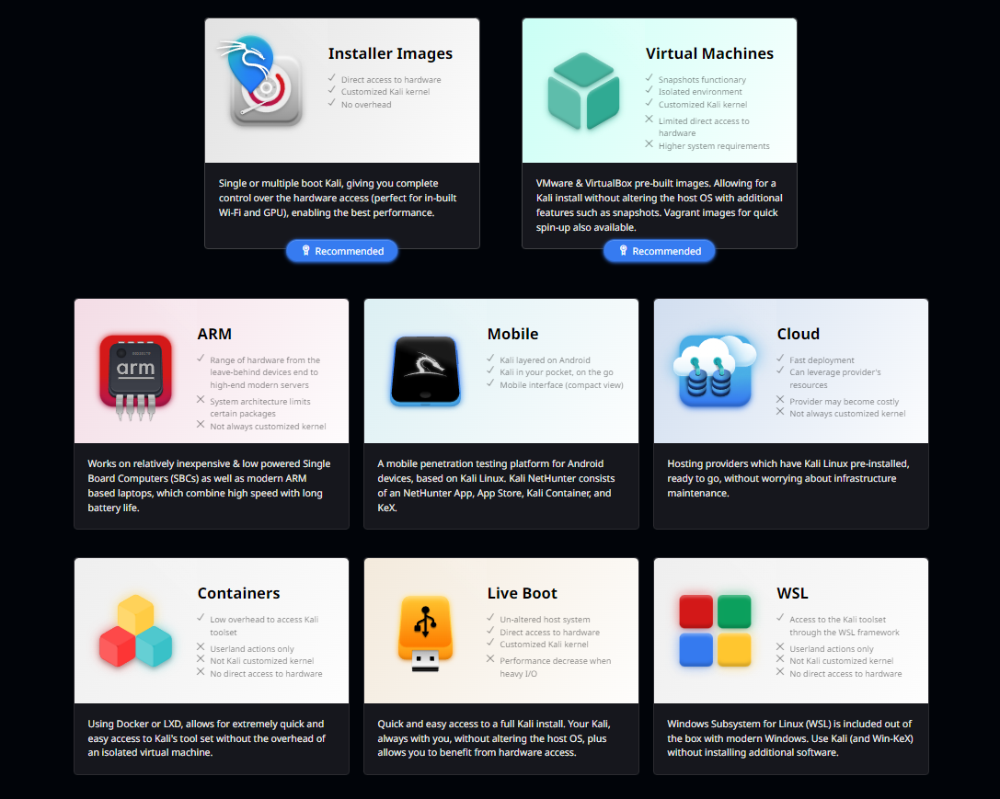

Algunas de las herramientas populares incluidas en Kali Linux son Nmap, Wireshark, Metasploit, Aircrack-ng, John the Ripper, Burp Suite, y muchas otras.
Kali Linux es altamente valorado en la comunidad de seguridad informática debido a su accesibilidad y la amplia gama de herramientas que ofrece. Sin embargo, debe ser utilizado con responsabilidad y de manera ética, ya que su uso indebido puede ser ilegal y perjudicial.
## Descarga de Kali Linux
Accedemos a la parte de descargas, para obtener la opción de descargas.

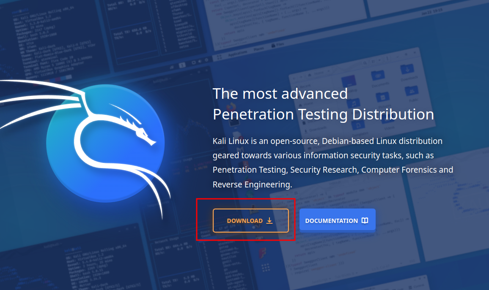

Al acceder a la sección de descargas, seleccionamos la opción de máquinas virtuales para explorar las diferentes alternativas disponibles para los sistemas de virtualización.

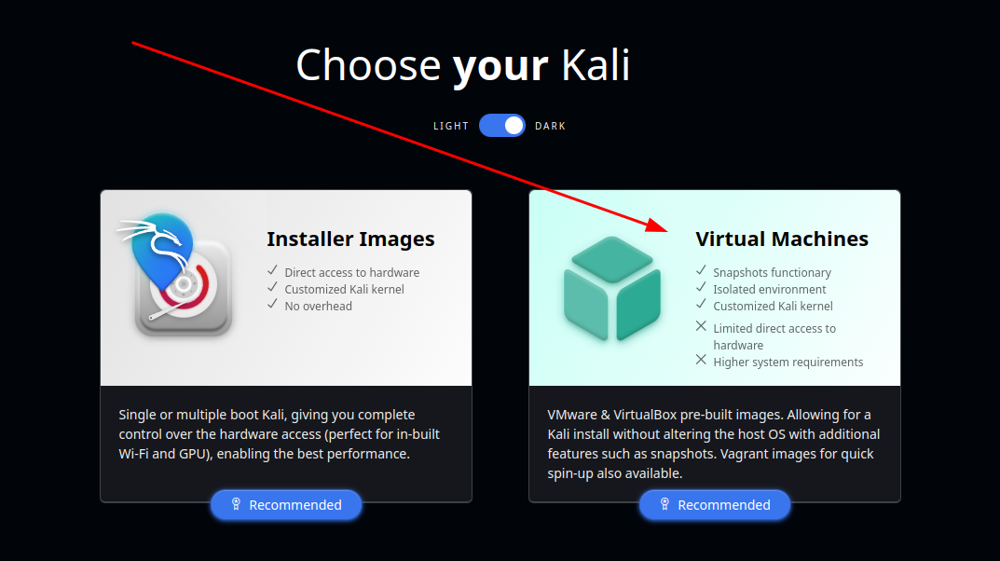

Elegimos la opción donde vayamos a configurar nuestra maquina virtual, en este caso vamos a utilizar VMware.

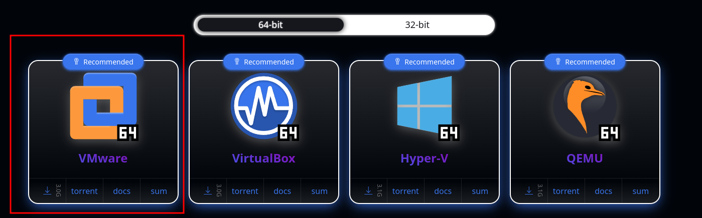

Elegimos la ruta donde vamos a descargar nuestra archivo comprimido de la maquina virtual.

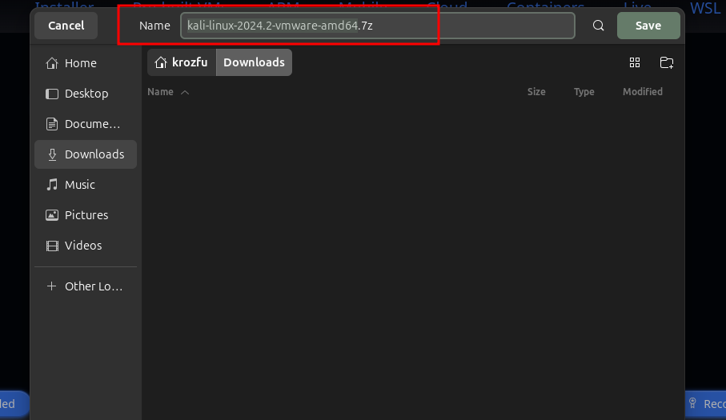

## Descomprimir el archivo
Luego de haber elegido la ruta de descarga procedemos a descomprimir el archivo 7zip, y proceder a acceder a los archivos que van hacer cargados a VMware.

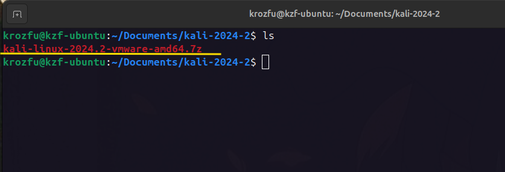

Con el siguiente comando descomprimimos un archivo en Linux con extensión 7z.

```bash
7z x kali-linux-2024.2-vmware-amd64.7z
```

Comienza a descomprimir el archivo y esperamos a que finalice el proceso.

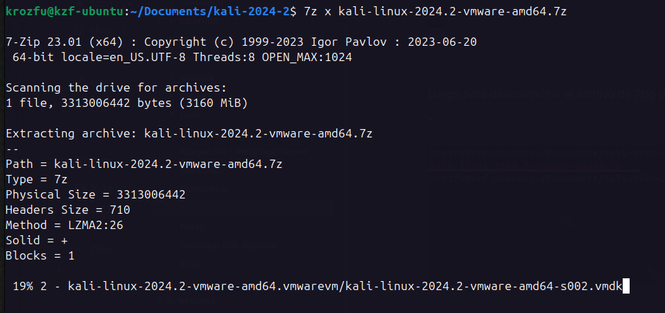

Proceso al finalizar descomprimir el archivo.

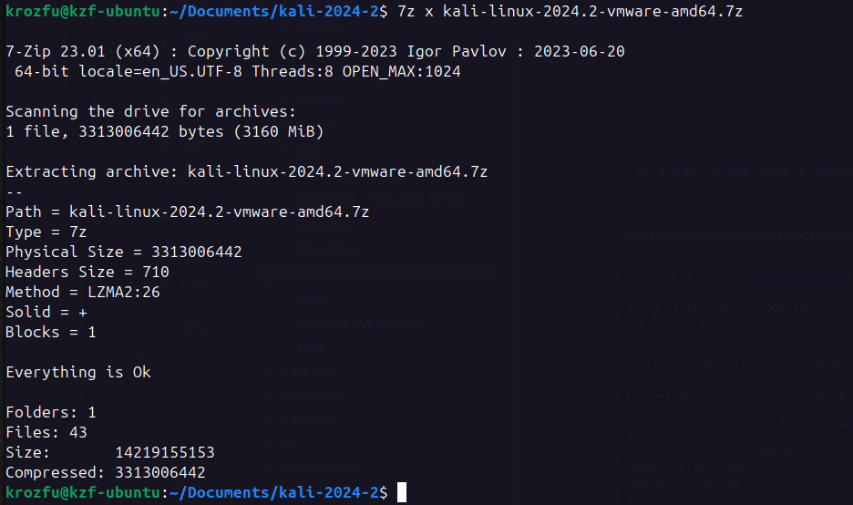

## Carga la maquina virtual a VMware
Para cargar la imagen de Kali Linux a VMware seleccionamos en abrir un archivo, seleccionamos la ubicación y elegimos en abrir la imagen.

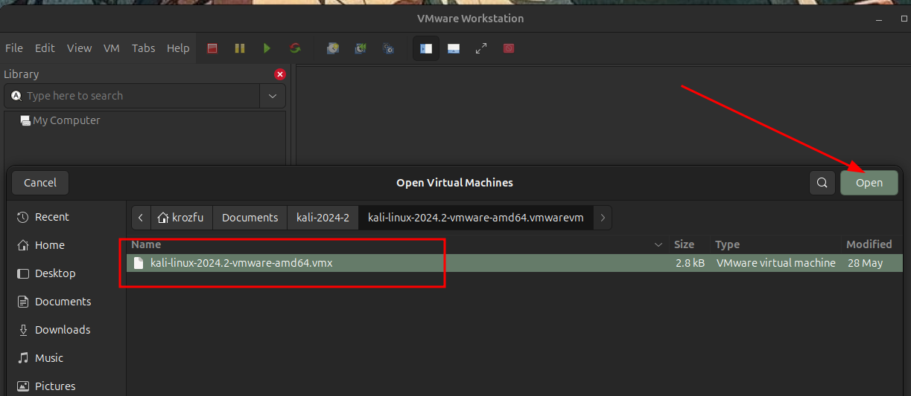

Al finalizar el proceso de carga, es recomendable configurar los requisitos de la máquina virtual para asegurar un mejor rendimiento durante el trabajo, teniendo en cuenta también las especificaciones de la máquina host.

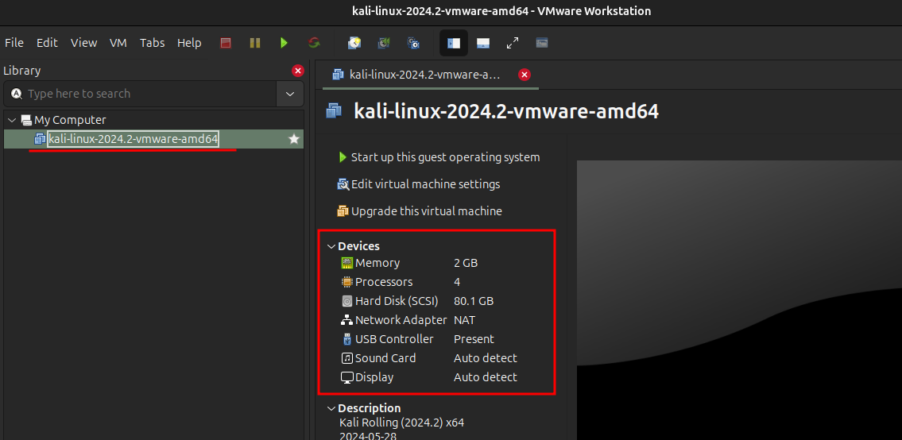

## Encender la maquina Kali Linux
Al terminar de configurar y encender la maquina ingresamos y el usuario y contraseñara por defecto son `kali`.

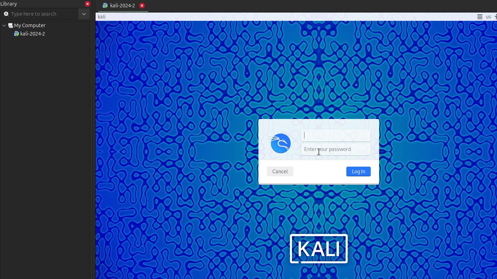
