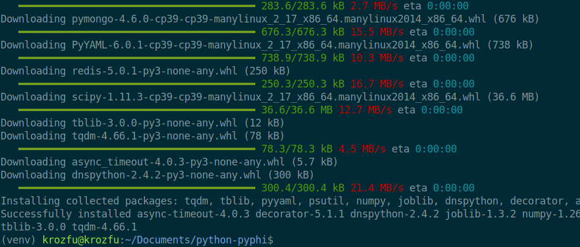
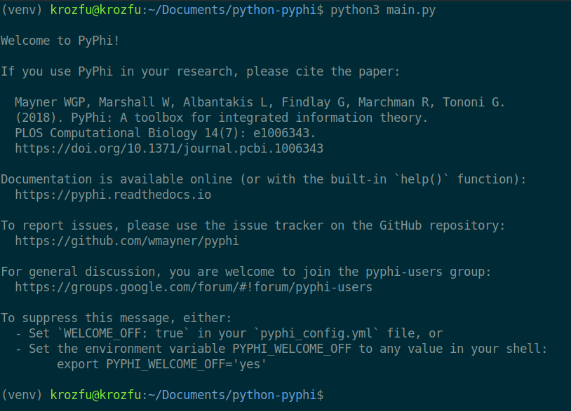

<div class="grid cards" markdown>

-   :material-information-outline: &nbsp; **Article Info**

    ---

    - 🌐 **Topic:** Python Environment & Library Setup
    - 💻 **OS:** Linux / WSL (Windows)
    - ⚡ **Level:** 🟢 Beginner

-   :material-tools: &nbsp; **Tools & Technologies**

    ---

    - `pyenv` — Python version management
    - `python3-venv` — Virtual environment
    - `pyphi` — Integrated Information Theory library
    - `pip` — Package installation

</div>

---

# Guía de instalación de PyPhi

El propósito de esta guía es explicar la instalación y configuración de la librería PyPhi. La librería admite sistemas operativos Linux y Windows, sin embargo, para sistemas Windows se recomienda utilizar el Subsistema de Windows para Linux (WSL). PyPhi únicamente es compatible con versiones de Python 3 inferiores a la 3.10, por lo que en este proyecto se empleará la versión estable 3.9.18.

A continuación, se detallan los pasos a seguir para configurar un entorno de desarrollo que permita ejecutar la librería PyPhi de forma correcta. Entre otros aspectos, se incluyen instrucciones sobre la instalación de Python, la configuración del entorno virtual y la descarga e instalación de la librería. El objetivo es brindar una guía clara y concisa que facilite la puesta en marcha de esta herramienta para el análisis de sistemas dinámicos discretos.

## **Pasos a seguir para la instalación:**

1. Primero instalar la versión de Python adecuada para correr PyPhi

```bash
# Actualización del sistema Linux
sudo apt-get update && sudo apt-get upgrade -y

# Instalación de dependencias para un sistema de versiones de python, para installar pyenv
sudo apt install -y build-essential libssl-dev zlib1g-dev libbz2-dev libreadline-dev libsqlite3-dev wget curl llvm libncurses5-dev libncursesw5-dev xz-utils tk-dev libffi-dev liblzma-dev python3-openssl git

# Instalación de pyenv en el sistema
curl https://pyenv.run | bash
```

1. Agregar variables de entorno en el sistema.
Para agregar el paso 2, se debe de abrir el archivo `.**bashrc**`, que es el archivo predeterminado que guarda las variables de entorno del sistema y agregar las siguiente líneas.

```bash
# Enable pyenv
export PATH="$HOME/.pyenv/bin:$PATH"
eval "$(pyenv init --path)"
eval "$(pyenv virtualenv-init -)"
```

1. Ejecutar el comando para guardar las variables de entorno en el sistema, donde se reiniciara la `bash` del sistema.

```bash
source ~/.bashrc
```

1. Instalar la versión de Python que necesitamos, para trabajar en el proyecto, en este caso vamos a utilizar la versión de Python 3.9.18.

```bash
pyenv install <version-python>
```

1. Verificación de las versiones instaladas en pyenv.

```bash
pyenv versions
```

1. Establecer la versión como predeterminada para el sistema.

```bash
# Tambien se usa para cambiar entre diferentes versiones
pyenv global <version-python>

# Si queremos solo ejecutar la versión solo para un directorio en especifico
pyenv local <version-python>
```

1. Verificar la versión instalada de Python.

```bash
python --version
```

1. Reiniciar la consola.

```bash
exec $SHELL
```

1. Instalar un ambiente virtual con python3-venv, para poder trabajar con PyPhi, esto nos permitirá mantener controlado un ambiente de desarrollo con los requerimientos que se instales para cada proyecto que se vaya a trabajar.

```bash
# Instalacion del paquete python3-venv
sudo apt-get install -y python3-venv

# Crear un ambiente virtual
python3 -m venv venv

# Activar el ambiente virtual
. venv/bin/activate
```

1. Instalar PyPhi, con el siguiente comando, ya instalado el ambiente de desarrollo se procede a instalar la librería.

```bash
pip install pyphi
```

1. Finalización de instalación



1. Test de importación de la librería pyphi, para verificar la instalación se crea un archivo **main.py,** donde se importa la librería pyphi para verificar su instalación.

```python
import os
import pyphi
```



Como se puede observar la librería esta instalada correctamente y ya se puede trabajar con los documentos planteados para realizar las siguientes fases del proyecto de Análisis y diseño de algoritmos.

1. Ejemplo tractico extraído de [Pyphi](https://pyphi.readthedocs.io/en/latest/examples/index.html#basic-usage), para observar un funcionamiento mas completo.

```python
import pyphi
import numpy as np

tpm = np.array([
 [0, 0, 0],
 [0, 0, 1],
 [1, 0, 1],
 [1, 0, 0],
 [1, 1, 0],
 [1, 1, 1],
 [1, 1, 1],
 [1, 1, 0]
])

cm = np.array([
 [0, 0, 1],
 [1, 0, 1],
 [1, 1, 0]
])

labels = ('A', 'B', 'C')
network = pyphi.Network(tpm, cm=cm, node_labels=labels)
state = (1, 0, 0)
node_indices = (0, 1, 2)
subsystem = pyphi.Subsystem(network, state, node_indices)
print(pyphi.compute.phi(subsystem))

sia = pyphi.compute.sia(subsystem)
print(sia)
print(len(sia.ces))
```

1. Para finalizar y salir del ambiente de desarrollo

```bash
deactivate
```

## Anexos

Se anexa el link a un video, donde se realizaron los pasos de esta guía.

<iframe width="560" height="315" src="https://www.youtube.com/embed/KJKJTTcrd1w" frameborder="0" allowfullscreen></iframe>

## Bibliografía

[PyPhi: A toolbox for integrated information theory](https://journals.plos.org/ploscompbiol/article?id=10.1371/journal.pcbi.1006343)

[pyphi](https://pypi.org/project/pyphi/)
