# **IMPLEMENTACIÓN Y CONFIGURACIÓN DE SERVICIOS SSH, DHCP, HTTP, DNS Y FTP EN UN SERVIDOR**

En este laboratorio se implementara una red, donde esta conectado un computador con Windows 10 y un servidor Ubuntu server 22.04.4 LTS, y se implementara los servicios de SSH, DHCP, HTTP, DNS, FTP.

## Pasos previos

Los pasos previos que se deben de realizar, se van a trabajar en el software de virtualización de [VirtualBox](https://www.virtualbox.org/), que es un sistema de virtualización gratuito y que nos facilita muchas cosas a la hora de empezar a administrar maquinas virtuales.

### Instalación de Ubuntu Server

Para la implementación de este laboratorio debes de tener instalado una maquina de Ubuntu server LTC, con su respectiva versión, en este caso vamos a trabajar con una versión de Ubuntu 24.04.4 LTC, puedes ver la instalación en el siguiente link de instalación de [Ubuntu Server](https://www.youtube.com/watch?v=IAXmRNG3A7k).

### Instalación de Windows

Para este laboratorio no es necesario tener un versión de Windows requerida, lo puedes hacer con la que desees, ya que solo hará de cliente para probar las respectivas funcionalidades configuradas en el Servidor.

### Configuración de la topología de red

Para realizar este laboratorio se tendrá una red aislada para conectar los diferentes equipos, simulando una red de conexión entre los equipos, esto nos ayuda a tener un laboratorio mas controlado y lograr hacer lo que se propone en la siguiente grafica.

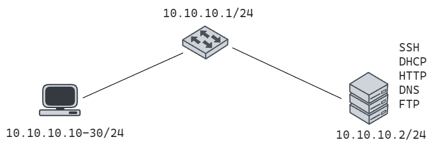

## Configuración de VirtualBox

### 1. Crear una nueva red aislada

Seguimos los siguientes pasos para crear la nueva red, elegimos `tools` y después en una `network manager` donde vamos a poder administrar las redes con virtual box.

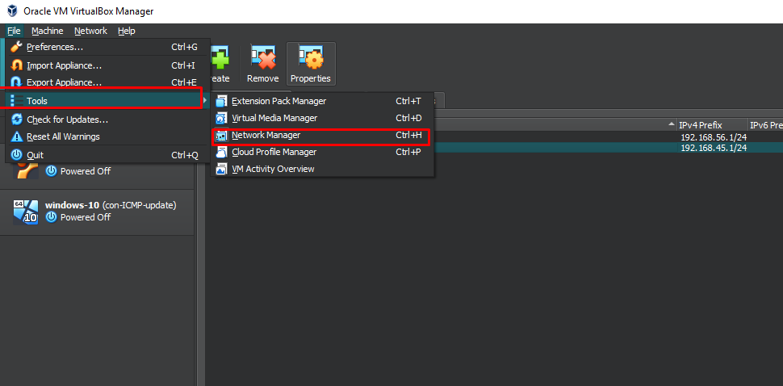

Y elegimos una red `Host-only Networks`.

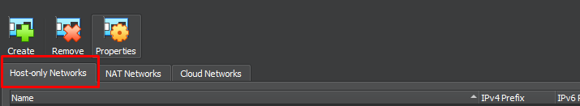

### 2. Para crear una nueva red

Para crear la nueva red, le damos en el botón `create` y aceptamos los permisos necesario para proceder a crear la red.

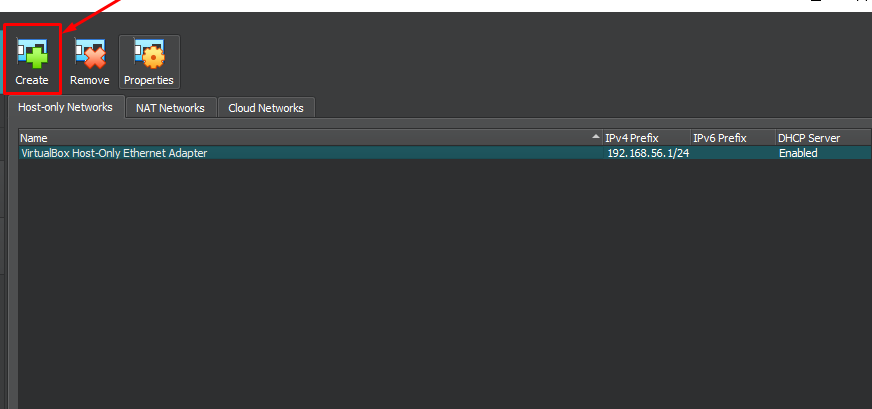

### 3. Configuración de dirección de red

Procedemos a configurar la dirección de red que va a tener esta nueva red, en este caso no nos deja elegir una red, a partir de 1, con lo cual configuramos la dirección de red `10.10.10.1`.

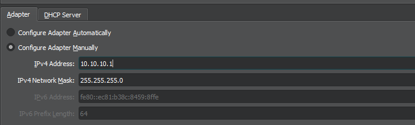

Y dejamos la configuración de DHCP que nos facilita VirtualBox como deshabilitada, ya que posteriormente la vamos a configurar con el servidor de Ubuntu.

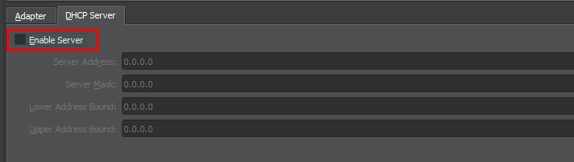

## Configuración de dos interfaces de red para Ubuntu Server y Windows 10

### Administración de Redes en Ubuntu Server

Vamos a configurar dos interfaces de res al servidor de Ubuntu server para mayor facilidad de trabajo, ya que va a tener una interfaz de red para conectarse a internet y otra para conectarse a la red interna creada.
Vamos a ingresar a la parte de red de la maquina y configuramos dos adaptadores.

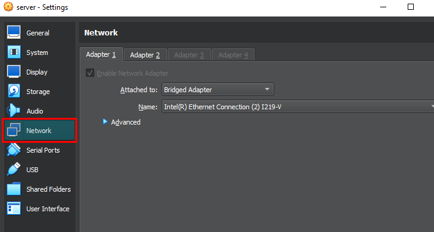

Y debemos de configurar el **primer adaptador** como se muestra en la imagen, donde este tendrá acceso desde la maquina principal y con acceso a la red.

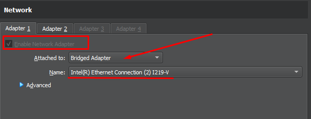

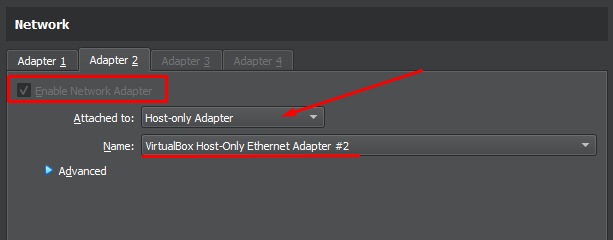

### Administración de Red Windows 10

Para configurar la red en Windows 10, solo debe habilitar una red, la cual será la conexión con el servidor Ubuntu, que proveerá los servicios a configurar.

Y el cual esta conectado a la red interna que se configuro anteriormente.

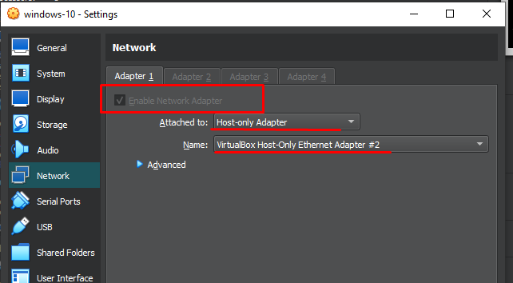

## Conexión con MobaXterm a Servidor

Esta configuración se realiza para facilitar el trabajo, ya que utilizaremos una conexión `ssh` para ejecutar comandos desde la máquina principal, conectándonos a través de un servidor de conexión remota, como puede ser [PUTTY](https://www.putty.org/), [MobaXterm](https://mobaxterm.mobatek.net/), [Solar-PuTTY](https://www.solarwinds.com/es/free-tools/solar-putty), [OPENSSH](https://www.openssh.com/), CMD, entre muchas otras herramientas que nos facilitan el trabajo.

Esta configuración la realizaremos desde MobaXterm, que es mi herramienta de trabajo, cuando ya ingresemos a la maquina de Ubuntu Server, vamos el siguiente comando para conocer su dirección de IP para conexión remota y las interfaces de red disponibles para este servidor.

```bash
# Comando completo
main@main-server:~$ ip addres

# Comando con su abreviatura
main@main-server:~$ ip a
```

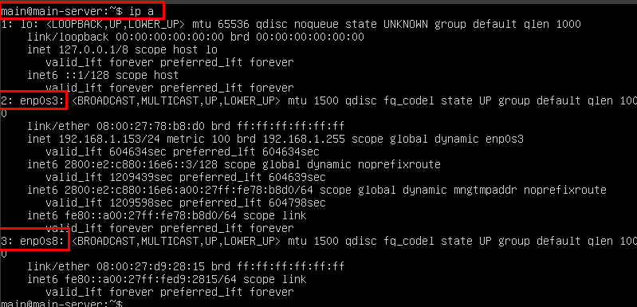

Observamos que sus interfaces de red configuradas anteriormente con el gestor de red de VirtualBox son la `enp0s3` y `enp0s8`, la cual la interfaz de red 2 y la IP `192.168.1.153`, nos ofrece la dirección de red para conexión remota con `ssh`. Este protocolo de conexión viene al momento de instalar Ubuntu Server, se se siguió los pasos respectivos previos, ya tienes `ssh` en el servidor, y si no lo tienes revisa el paso posterior donde se va a instalar SSH y debes primero realizar esa configuración de instalación, para realizar este paso.

### Conexión con MobaXterm

Realizamos una nueva sesión de conexión.

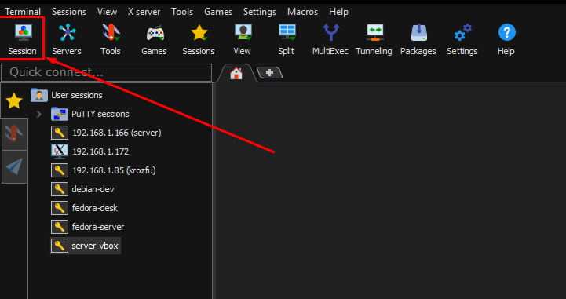

Y accedemos por medio de SSH y configuramos la IP y el nombre de usuario configurado anteriormente, para este caso mi dirección IP es `192.168.1.153` y mi usuario `main`.

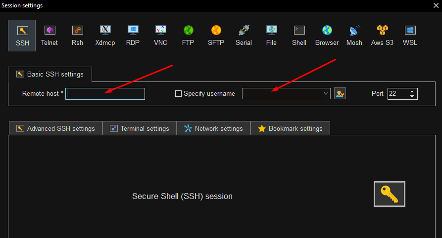

Una vez ingresado los parámetros te pedirá la contraseña y lograras acceder al servidor.

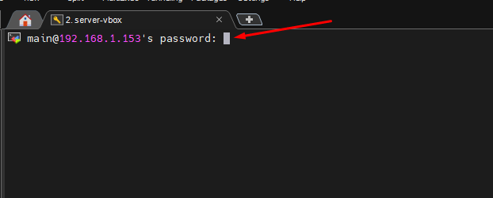

Una vez ingresado ya puedes realizar las configuraciones mas fácilmente.

## Crear un servidor con Ubuntu Server

### 0. Configuración de IP estática para interfaz de red Servidor

Vamos a configurar la IP de servidor Ubuntu de la interfaz de red aislada para realizar conexión con la maquina de Windows 10.

Para ingresar a la configuración debemos de editar el siguiente archivo con el siguiente comando, en este caso vamos a utilizar el editor de código `vim`, puedes utilizar otro editor código de línea de comandos como `nano`.

```bash
sudo vim /etc/netplan/00-installer-config.yaml
```

Y configuramos la el archivo `yaml` de la siguiente forma.

```yaml
network:
  ethernets:
    enp0s3:
      dhcp4: true
    enp0s8:
      addresses: [10.10.10.2/24]
  version: 2
```

Lugo de configurar la IP estática guardamos los cambios con `wq`(este comando solo sirve para vim) y aplicamos los cambios con el siguiente comando.

```bash
sudo netplan apply
```

Y ya podemos observar que tenemos configurada la IP de esta nueva interfaz de red.

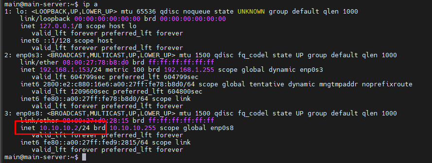

### 1. Configuración de SSH

Vamos a configurar el servidor SSH para poder tener desde otra maquina, con el protocolo para compartir y tener conexión con otro dispositivo de manera segura.
Comprobamos si el servicio de SSH esta corriendo en el sistema, utilizando el siguiente comando.

```bash
systemctl status ssh
```

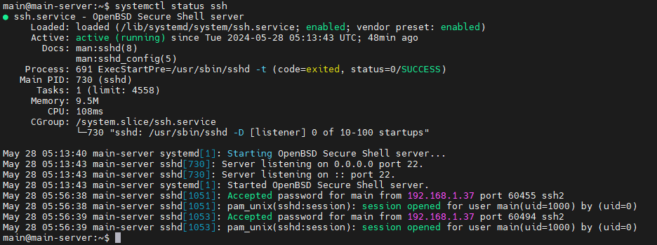

Se puede comprobar que el servicio esta corriendo y que esta activado, si no esta instalado debes de ejecutar el siguiente comando y comprobar su estado.

```bash
# Installar openssh
sudo apt-get install openssh-server

# Verificar su estado
systemctl status ssh
```

### 2. Configuración de DHCP

Luego de haber configurado la dirección IP estática para el servidor Ubuntu, vamos a proceder a instalar el servicio de DHCP, para que preste el servicio a otras maquinas la prestación de una IP en el rango de IPs.

Para instalar el servicio de DHCP `isc-dhcp-server`, ejecutamos el siguiente comando.

```bash
sudo apt install isc-dhcp-server -y
```

Luego de instalar el servicio de DHCP, entramos a configurar el archivo de configuración `dhcpd.conf`, donde vamos se va a agregar las configuraciones de red adecuadas para la asignación de la red en DHCP.

```bash
sudo vim /etc/dhcp/dhcpd.conf
```

```bash
# DHCP PARA LA RED
group red-interna {
subnet 10.10.10.0 netmask 255.255.255.0 {
 range 10.10.10.10 10.10.10.30;
 default-lease-time 3600;
 max-lease-time 86400;
 option domain-name-servers 10.10.10.2;
 option domain-name "redes.local";
 option subnet-mask 255.255.255.0;
 option routers 10.10.10.1;
 option broadcast-address 10.10.10.255;
}
}
```

Y se agrega la configuración al final del archivo.

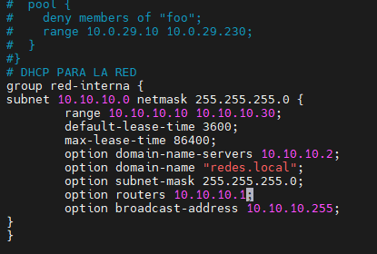

Y verificamos si la configuración esta correctamente configurada.

```bash
sudo dhcpd -t -cf /etc/dhcp/dhcpd.conf
```

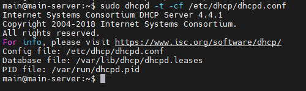

Procedemos a configurar  la interfaz de red del servidor DHCP.

```bash
sudo vim /etc/default/isc-dhcp-server
```

Y se modifica la siguiente línea en el archivo dependiendo del nombre de la interfaz de red que tenga, para nuestro caso es la `enp0s3`, como se muestra a continuación.


```bash
NTERFACESv4="enp0s8"
```

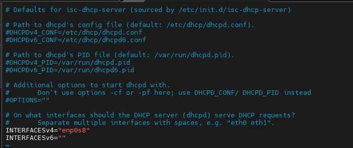

Finalmente procedemos a reiniciar el servicio DHCP y revisamos el estados si está activo, ejecutamos las dos primeras líneas en la terminal por separado.

```bash
sudo systemctl restart isc-dhcp-server
sudo systemctl status isc-dhcp-server
```

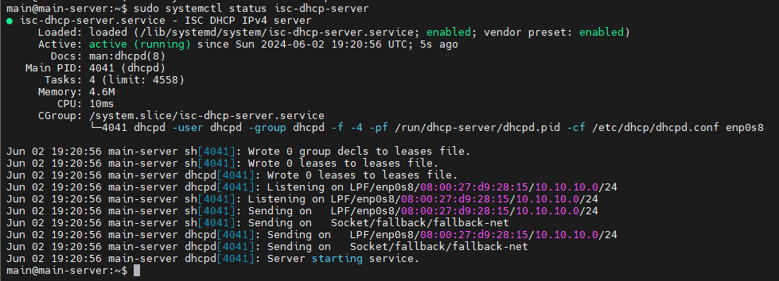

#### Verificamos la IP en el sistema cliente de Windows 10

Podemos comprobar ingresando al símbolo del sistema de Windows 10, y ingresar el siguiente comando para comprobar la configuración de DHCP.

```bash
ipconfig
```

Como se puede observar, en las configuraciones de red, ya el servidor DHCP, nos dio la IP `10.10.10.20` y con puerta de enlace `10.10.10.1`, las que fueron configuradas en el servidor de Ubuntu.

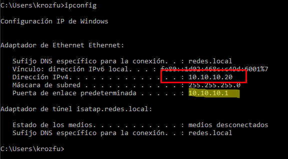

### 3. Configuración de FTP

Para el servidor FTP, vamos instalar el siguiente servicio `vsftpd` en el servidor de Ubuntu Server.

```bash
sudo apt-get install vsftpd -y
```

Luego de instalar el servicio para `ftp`, se realiza la modificación de un archivo del sistema, para poder realizar la conexión con el sistema.

```bash
sudo vim /etc/vsftpd.conf
```

La siguiente línea comentada debe descomentarse para activar el traspaso de archivos.

```bash
write_enable=YES
```

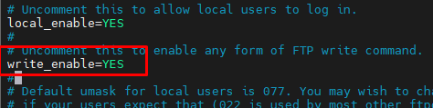

Procede a reiniciar el servicio de `ftp`, con la ejecución de la siguientes líneas por separado.

```bash
sudo service vsftpd restart
sudo service vsftpd status
```

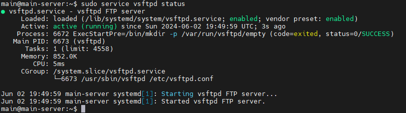

#### Comprobar el servicio ftp desde windows

Para probar si el servicio de ftp esta corriendo perfectamente lo vamos a hacer a través de una herramienta llamada `WinSCP`.

Configuramos los parámetros para realizar la conexión con la dirección IP del servidor y el usuario respectivo y la contraseña.

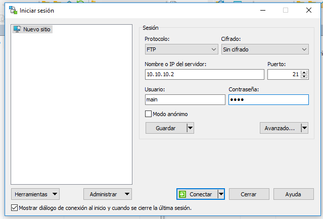

Al finalizar ya tenemos la conexión respectiva, y podemos compartir archivos entre la maquina cliente y el servidor.

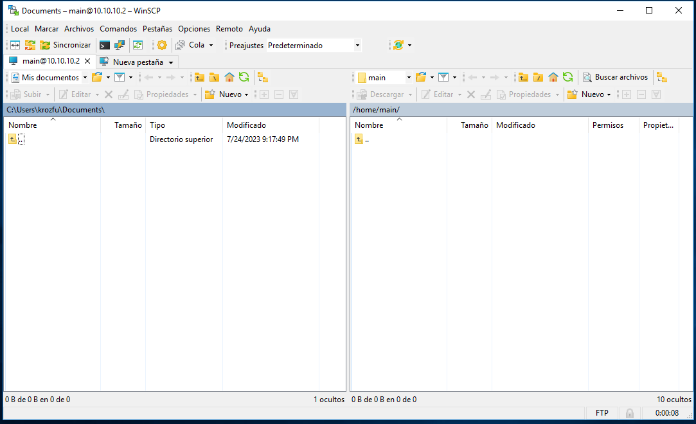

### 4. Configuración de DNS

Instalar DNS con BIND9

```bash
sudo apt install bind9 bind9-utils -y
```

Verificamos el estatus de `bind9` para ver si todo esta funcionando bien.

```bash
sudo systemctl status bind9
```

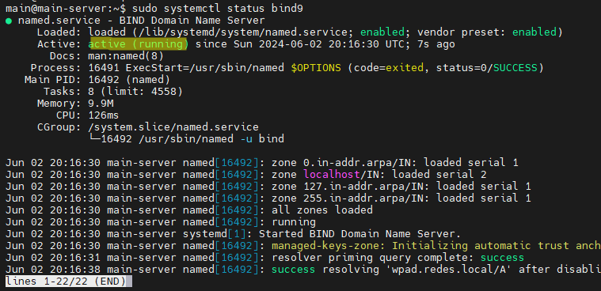

Permitir de forma sencilla en el Firewall local, el acceso al puerto y protocolo que utiliza Bind9

```bash
sudo ufw allow bind9
```

Configuración mínima de Bind9

```bash
sudo vim /etc/bind/named.conf.options
```

Líneas a modificar, agregar o eliminar (el archivo debe contener lo siguiente),y si estan la lineas `dnssec-validation auto;` y `listen-on-v6 { any; };` se deben de comentar en el archivo.

```bash
listen-on { any; };
allow-query { localhost; 10.10.10.0/24; };
forwarders {
        8.8.8.8;
        8.8.4.4;
};

#dnssec-validation auto;
dnssec-validation no;
#listen-on-v6 { any; };
```

El archivo debe de quedar con las siguientes configuraciones.

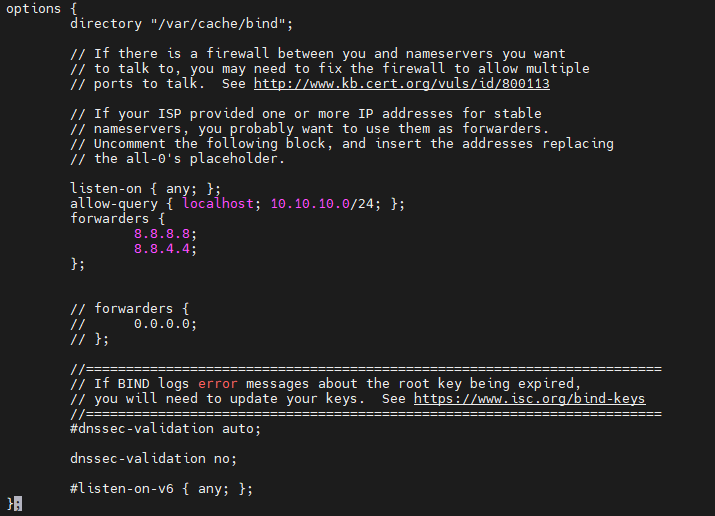

Obligar el uso único de IPv4, modificando el siguiente archivo, y modificando la siguiente línea `OPTIONS="-u bind -4"`.

```bash
sudo vim /etc/default/named
```

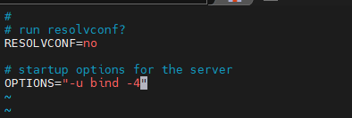

Comprobar la configuración de Bind9 y reiniciar el servicio si todo está bien, luego lanzar status para ver si no hay errores.

```bash
sudo named-checkconf
sudo systemctl restart bind9
sudo systemctl status bind9
```

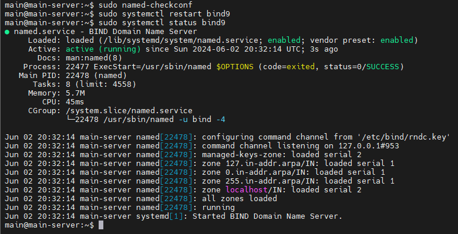

#### Agregamos las zonas

Modificamos el siguiente archivo, creando las respectivas Zonas, tanto directa como inversa.

```bash
sudo vim /etc/bind/named.conf.local
```

```bash
zone "networld.cu" IN {
        type master;
        file "/etc/bind/zonas/db.networld.cu";
};

zone "10.10.10.in-addr.arpa" {
        type master;
        file "/etc/bind/zonas/db.10.10.10";
};
```

Creando el **directorio** donde guardaremos los archivos de zonas y luego creamos las dos zonas, la directa y la inversa.

```bash
sudo mkdir /etc/bind/zonas
```

Y creamos el siguiente archivo con la siguiente modificación

```bash
sudo vim /etc/bind/zonas/db.networld.cu
```

```bash
$TTL    1D
@       IN      SOA     ns1.networld.cu. admin.networld.cu. (
        1               ; Serial
        12h             ; Refresh
        15m             ; Retry
        3w              ; Expire
        2h  )           ; Negative Cache TTL

;       Registros NS

        IN      NS      ns1.networld.cu.
ns1     IN      A       10.10.10.2
www     IN      A       10.10.10.2
```

Y creamos el siguiente archivo

```bash
sudo vim /etc/bind/zonas/db.10.10.10
```

```bash
$TTL    1d ;
@       IN      SOA     ns1.networld.cu admin.networld.cu. (
                        20210222        ; Serial
                        12h             ; Refresh
                        15m             ; Retry
                        3w              ; Expire
                        2h      )       ; Negative Cache TTL
;
@      IN      NS      ns1.networld.cu.
1      IN      PTR     www.networld.cu.
```

Comprobar los archivos de zona que acabamos de crear para ver si todo está bien.

```bash
sudo named-checkzone networld.cu /etc/bind/zonas/db.networld.cu
```

```bash
sudo named-checkzone db.10.10.10.in-addr.arpa /etc/bind/zonas/db.10.10.10
```

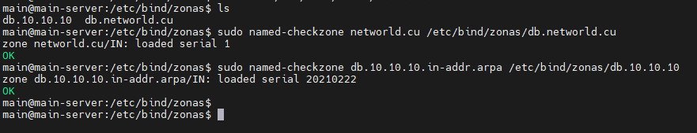

Reiniciamos nuevamente

```bash
sudo systemctl restart bind9
```

Comprobar funcionamiento desde el host cliente.

```bash
ping www.networld.cu
ping ns1.networld.cu
```

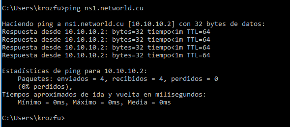

### 5. Configuración de HTTP

Para la instalación del servicio HTTP, se va a utilizar Apache de Ubuntu, con lo cual para los pasos para instalar son muestran a continuación.

El siguiente comando es para instalar apache2.

```bash
sudo apt install apache2 -y
```

Para iniciar el servicio de apache se ejecuta el siguiente comando.

```bash
sudo systemctl start apache2
```

Para habilitar el servicio de apache2 ejecutamos el siguiente comando.

```bash
sudo systemctl enable apache2
```

Finalmente se comprueba si esta corriendo el servicio de apache.

```bash
sudo systemctl status apache2
```

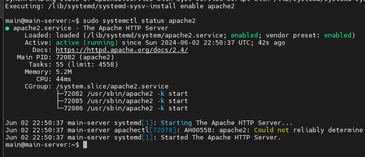

Luego para probar el servicio de HTTP y de DNS entramos desde la maquina cliente y probamos la URL `www.networld.cu`.

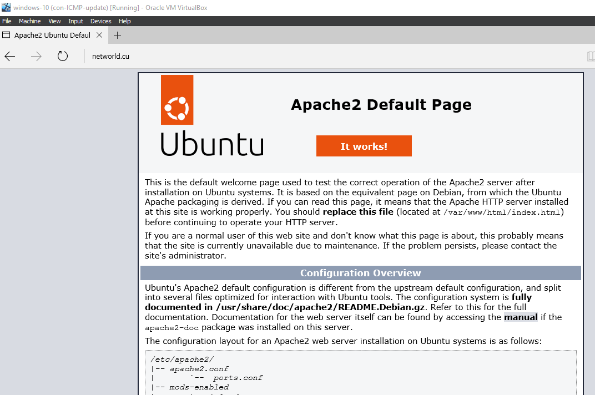
