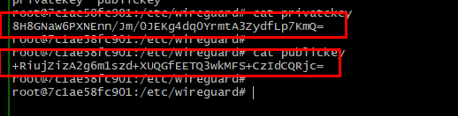

# Implementación de WireGuard entre dos contenedores de Docker

En un servidor Ubuntu Server 22.04.4 LTS, se implementará una VPN utilizando Docker para establecer una conexión segura entre dos contenedores. Esta conexión se realizará mediante la tunelización de los contenedores a través del protocolo VPN WireGuard.

  
Versión del servidor de Ubuntu Server.

## Requisitos previos
1. Tener Docker instalado en tu sistema, se puede guiar de los anexos, que son guías en formato digital para instalar Docker.
2. Acceso a internet para descargar las imágenes de Docker necesarias.
3. Conocimientos básicos de Docker y redes.
---
Para conectar dos contenedores de Docker con una VPN de WireGuard, puedes seguir estos pasos:

## 1. Crear una red interna de Docker
Se creó una red para almacenar los dos contenedores de Docker y poder realizar la respectiva conectividad.
```bash
docker network create --driver bridge vpn-net
```


## 2. Crear los contenedores
Se  configuran los dos contenedores, tanto para el servidor como para el cliente.

Contenedor de Servidor
```bash
docker run -dit \
  --name server \
  --cap-add=NET_ADMIN \
  --cap-add=SYS_MODULE \
  -v server:/etc/wireguard \
  --network=vpn-net \
  --rm \
  linuxserver/wireguard
```

Contenedor de cliente
```bash
docker run -dit \
  --name client \
  --cap-add=NET_ADMIN \
  --cap-add=SYS_MODULE \
  --cap-add=SYS_PTRACE \
  -v client:/etc/wireguard \
  --network=vpn-net \
  --rm \
  linuxserver/wireguard
```

Se puede observar los dos contenedores en ejecución.


## 3. Configurar el servidor
Para generar las claves públicas y privadas dentro del servidor, primero accede al contenedor del **server**. Luego, configura la red de VPN utilizando estas claves privada y publica.
Accede al contenedor del servidor:

```bash
docker exec -it server /bin/bash
```
Genera una clave pública y privada para el servidor:
```bash
wg genkey | tee /etc/wireguard/privatekey | wg pubkey > /etc/wireguard/publickey
```


Configuramos ahora la interfaz de red wg0
```bash
[Interface]
Address=10.13.13.1/24
PrivateKey=aCcGAmPrZIm5GJ+MHsGzbJ4vh5PKB43lplLbBZds0XU=
ListenPort=51820

[Peer]
PublicKey=+RiujZizA2g6m1szd+XUQGfEETQ3wkMFS+CzIdCQRjc=
AllowedIPs=10.13.13.2/32
Endpoint=172.19.0.3:51820
```

## 4. Configurar el cliente
Para generar las claves públicas y privadas dentro del servidor, primero accede al contenedor del **client**. Luego, configura la red de VPN utilizando estas claves privada y publica.
Igualmente accedemos al contenedor del cliente.

```bash
docker exec -it client /bin/bash
```

Genera una clave pública y privada para el cliente:
```bash
wg genkey | tee /etc/wireguard/privatekey | wg pubkey > /etc/wireguard/publickey
```


Configuramos ahora la interfaz de red wg0
```bash
[Interface]
Address=10.13.13.2/24
PrivateKey=8H8GNaW6PXNEnn/Jm/0JEKg4dq0YrmtA3ZydfLp7KmQ=
ListenPort=51820

[Peer]
PublicKey=xIfYNOGJRYyKe/d7p3wZ+dM8/jijMoeFcs9V3flRAik=
AllowedIPs=10.13.13.1/32
Endpoint=172.19.0.2:51820
```

## 5. Iniciar la VPN en el servidor y el cliente
En el contenedor del servidor:
```bash
wg-quick up wg0
```


En el contenedor del cliente:
```bash
wg-quick up wg0
```


## 6. Verificación de creación de la VPN
Conexión de la VPN en servidor  
  

Conexión de la VPN en el cliente
  

## 7. Verificar la conexión
Verificar envío de paquete ICMP desde el contenedor de servidor.
```bash
ping 10.13.13.2
```


Verificar envió de paquete ICMP desde el contenedor de cliente.
```bash
ping 10.13.13.1
```


## 8. Desactivar la VPN creada con Wireguard
Para terminar de la conexión de la VPN entre los dos contenedores se debe de realizar el siguiente comando en el contenedor de **Servidor** y **Cliente**.
```bash
wg-quick down wg0
```
